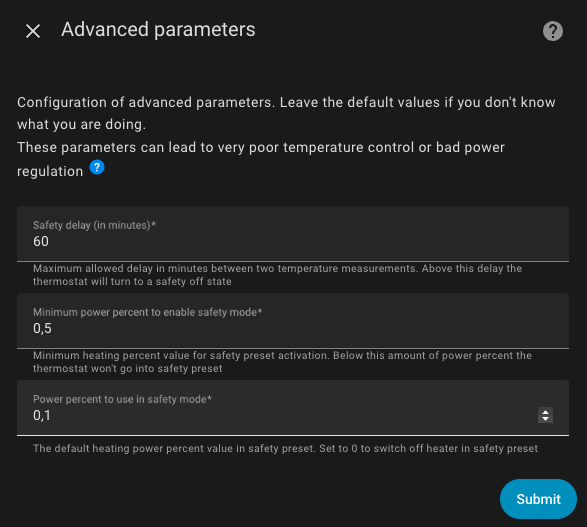

# Advanced Configuration

- [Advanced Configuration](#advanced-configuration)
  - [Advanced Settings](#advanced-settings)
    - [Safety Mode](#safety-mode)

These settings refine the thermostat's operation, particularly the safety mechanism for a _VTherm_. Missing temperature sensors (room or outdoor) can pose a risk to your home. For instance, if the temperature sensor gets stuck at 10°C, the `over_climate` or `over_valve` _VTherm_ types will command maximum heating of the underlying devices, which could lead to room overheating or even property damage, at worst resulting in a fire hazard.

To prevent this, _VTherm_ ensures that thermometers report values regularly. If they don't, the _VTherm_ switches to a special mode called Safety Mode. This mode ensures minimal heating to prevent the opposite risk: a completely unheated home in the middle of winter, for example.

The challenge lies in that some thermometers—especially battery-operated ones—only send temperature updates when the value changes. It is entirely possible to receive no temperature updates for hours without the thermometer failing. The parameters below allow fine-tuning of the thresholds for activating Safety Mode.

If your thermometer has a `last seen` attribute indicating the last contact time, you can specify it in the _VTherm_'s main attributes to greatly reduce false Safety Mode activations. See [configuration](base-attributes.md#choosing-base-attributes) and [troubleshooting](troubleshooting.md#why-does-my-versatile-thermostat-switch-to-safety-mode).

For `over_climate` _VTherms_, which self-regulate, Safety Mode is disabled. In this case, there is no danger, only the risk of an incorrect temperature.

## Advanced Settings

The advanced configuration form looks like this:



### Safety Mode

The second delay (`safety_delay_min`) is the maximum time between two temperature measurements before the _VTherm_ switches to Safety Mode.

The third parameter (`safety_min_on_percent`) is the minimum `on_percent` below which Safety Mode will not be activated. This setting prevents activating Safety Mode if the controlled radiator does not heat sufficiently. In this case, there is no physical risk to the home, only the risk of overheating or underheating.
Setting this parameter to `0.00` will trigger Safety Mode regardless of the last heating setting, whereas `1.00` will never trigger Safety Mode (effectively disabling the feature). This can be useful to adapt the safety mechanism to your specific needs.

The fourth parameter (`safety_default_on_percent`) defines the `on_percent` used when the thermostat switches to `security` mode. Setting it to `0` will turn off the thermostat in Safety Mode, while setting it to a value like `0.2` (20%) ensures some heating remains, avoiding a completely frozen home in case of a thermometer failure.

It is possible to disable Safety Mode triggered by missing data from the outdoor thermometer. Since the outdoor thermometer usually has a minor impact on regulation (depending on your configuration), it might not be critical if it's unavailable. To do this, add the following lines to your `configuration.yaml`:

```yaml
versatile_thermostat:
...
    safety_mode:
        check_outdoor_sensor: false
```

By default, the outdoor thermometer can trigger Safety Mode if it stops sending data. Remember that Home Assistant must be restarted for these changes to take effect. This setting applies to all _VTherms_ sharing the outdoor thermometer.

>  _*Notes*_
> 1. When the temperature sensor resumes reporting, the preset will be restored to its previous value.
> 2. Two temperature sources are required: the indoor and outdoor temperatures. Both must report values, or the thermostat will switch to "security" preset.
> 3. An action is available to adjust the three safety parameters. This can help adapt Safety Mode to your needs.
> 4. For normal use, `safety_default_on_percent` should be lower than `safety_min_on_percent`.
> 5. If you use the Versatile Thermostat UI card (see [here](additions.md#better-with-the-versatile-thermostat-ui-card)), a _VTherm_ in Safety Mode is indicated by a gray overlay showing the faulty thermometer and the time since its last value update: .